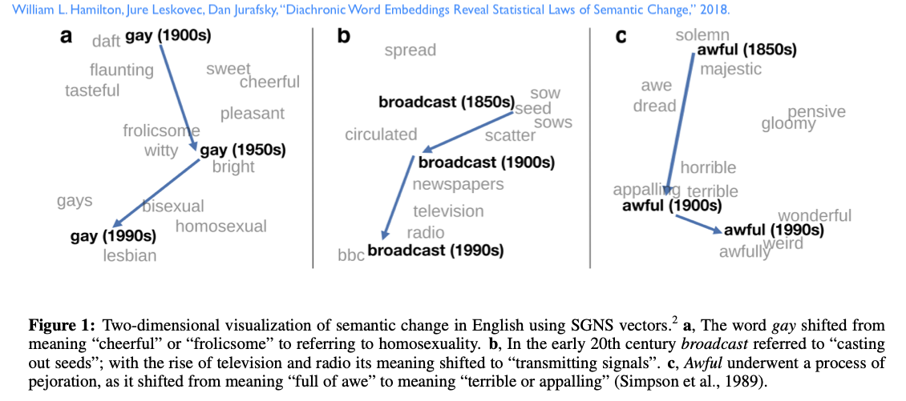
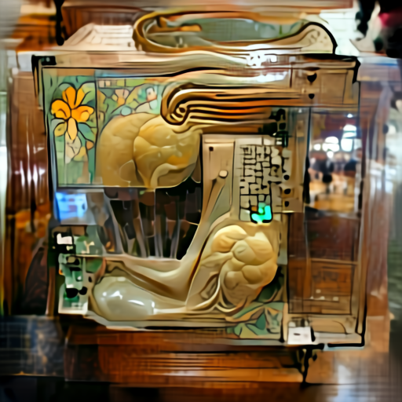

# Syllabus

#### Instructor: Ted Underwood


tunder (at) illinois.edu

Office: English Building 339 until 6th and Daniel opens

Office Hours: Thursday, 2-3, either in person or on zoom 

#### TA: Yuerong Hu

## Objectives

While data science can be used to explore many domains, human culture is one of the most rewarding and challenging. Most cultural materials start out as unstructured texts, sound files, or images—not neat spreadsheets. Cultural questions also highlight the importance of interpreting statistical models in relation to a social context. Last but not least: stories, poems, and images confront us with vivid problems that are inherently fun to explore.

Our main goals in the course are to

- understand what kinds of insights data science can (and can't) provide about human culture
- understand the mathematical principles and strategies appropriate for unstructured, high-dimensional data
- get hands-on experience using Pandas to manipulate data, and using Python to model texts and images

A semester of previous exposure to some programming language is a prerequisite for this course; the programming language you've used doesn't need to be Python, but you should be quite comfortable with concepts like "variable assignment" and "for loops."

## Assignments 

There are four kinds of assignments in this class: homework (in Python), informal posts in the discussion forum, five low-stakes quizzes, and a final project (individual or group) that uses data science to investigate a question about history or human culture.

**Homework.** There will be nine homework assignments. Each one takes the form of a Jupyter notebook. In the early weeks of the class I will usually start the notebook and then ask you to finish it in a way that addresses a short list of questions.

To hand in your homework, print your notebook as a .pdf file (you can do this under "File" in JupyterLab or Colaboratory) and submit the .pdf on Canvas—-with either the .ipynb file or a link to a Google Colab as a supporting attachment. 

We will often be able to grade the notebook by examining your code and results in the .pdf. But sometimes we have to re-run your code to understand what happened. To make this easier, please make sure that the .pdf you hand in *reflects the results produced when all the cells are run in order, top to bottom.* Usually, to be sure this is the case, you need to re-run everything from the top before printing and handing in the pdf.

It may also be easier for us to reproduce your results if you keep your homework in a subdirectory within the /is417 folder, and refer to data files with relative paths that point to their location in /is417, like '../data/first_dataframe.tsv'.

We will drop the lowest homework grade, so if you miss one, that's not a disaster.

**Forum posts.** Four times during the semester, write a brief paragraph-length comment in the discussion forum. Usually these will be comments on the reading for a particular day; I'll use them to organize discussion. Toward the end of the class we'll also use the forum to discuss challenges you've encountered in your projects. Those posts also count toward your four.

**Quizzes.** Five times during the semester I'll assign a short (three to six question) quiz on the reading. These quizzes should be completed before the class when the reading is due. The questions will be rather easy; this is mainly an opportunity to review the reading.

**Final project.** Write an 8-12 page paper that uses some form of quantitative analysis to illuminate a question about human history or contemporary culture. Your results don't necessarily have to take the form of an experimental report (data-methods-results-conclusions). Some projects might more appropriately produce an annotated map, for instance, accompanied by a narrative. We're in a space between disciplines, so form is a place where you can be creative. 

Ideally, your project should be one that makes use of *unstructured, high-dimensional* data. So, for instance, a spreadsheet listing movie titles, expenses, and profits would be "in the humanities" in the sense that movies are a form of art. But two or three columns of numbers won't provide the kind of humanistic data that can stretch the skills you acquire in this class. Movie posters, or movie scripts, are more likely to do that.

Final projects can be written by individuals or groups. If you decide to organize in a group, you can be a more ambitious in your data gathering and analysis, and perhaps produce a slightly longer (10-16 page) paper.

Papers should be supported by code and data showing how you reached your conclusion. If you would like to make your project visible to an audience beyond the class, you're welcome (but not required) to do that, for instance, with a GitHub repository.

Homework assignments are worth 50% of the grade, forum posts and class participation are worth 10%, quizzes are worth 10%, and your final project is worth 30%.


### Getting help on assignments

I like Miriam Posner's ["ground rules for learning tech,"](https://twitter.com/miriamkp/status/1349095892700205057) and aspire to imitate them here.

In particular, I want to stress that I don't see the homework assignments as "tests," but as opportunities to learn. My goal is for everyone to succeed on all the assignments. 

Always start by trying to solve the problem yourself. A big part of learning to code is learning to make (and catch) mistakes, and that involves a certain amount of staring at the screen, googling whatever error message you're getting, [cursing DenverCoder9](https://xkcd.com/979/), groaning, etc. But if you've done that for an hour straight and seem to be hitting the same wall over and over, it's time to get help. Often it's something very simple! You can email me, or another student in class, and ask for a tip. Let me underline that again, because these ground rules are different from some classes: *I'm saying it's fine to email another student and ask for a clue*. The final notebook should be your own work, but it's okay to ask for help. (Don't post solutions openly on the class forum, though, because it's important for people to google the error message and curse DenverCoder9 first. Someday you'll hit a problem where no one knows the answer yet, and then it's going to matter that you've had a lot of practice groaning, enduring, trying different debugging strategies, etc.) 

Do *acknowledge* help in the notebook. "I copied parts of the sort_lyrics() function from DenverCoder9 at Stack Overflow, and also got advice from my roommate Carol." This will not detract from your grade; it's normal to borrow bits of code.

If you email me for help, I will try to respond within 48 hours, but I need to warn you in advance that a 48- to 72-hour delay is typical.

The quizzes should be done on your own. The questions will be straightforward multiple-choice questions that the reading can answer.

### Where I got help

This syllabus is strongly influenced by (and sometimes borrows directly from) two recent courses: Melanie Walsh, ["Introduction to Cultural Analytics and Python,"](https://melaniewalsh.github.io/Intro-Cultural-Analytics/features/Data-Analysis/Pandas-Basics-Part1.html) as well as Dan Sinykin, ["Practical Approaches to Data Science with Text."](https://github.com/sinykin/QTM-340/blob/master/docs/schedule.md)

# Schedule

Note that homework stops after March, and reading really slows down too, so you can focus on your projects.

### August 23: Introduction to Python and Jupyter Notebooks

Before coming to class, I recommend reviewing several sections of [Melanie Walsh's "Programming in Python,"](https://melaniewalsh.github.io/Intro-Cultural-Analytics/Python/Python.html#) especially if you're unfamiliar with Python.

Everyone will find [“The Command Line”](https://melaniewalsh.github.io/Intro-Cultural-Analytics/features/Command-Line/The-Command-Line.html) and [“How To Use Jupyter Notebooks”](https://melaniewalsh.github.io/Intro-Cultural-Analytics/features/Python/How-to-Use-Jupyter-Notebooks.html) useful preparation.

If you haven't worked in Python before, you may also find the other sections of Walsh's "Python Basics" useful, from "Anatomy of a Python Script" to "Common Python Errors." I'll cover this material in class, but I'll be going pretty quickly, so previous exposure will definitely help.

Once you're comfortable with the command line, I recommend [downloading git.](https://git-scm.com/downloads) We'll use this tool to distribute notebooks and data files.

If you don't already have a recent Anaconda installation of Python (version 3.7 or later), I recommend [downloading the Anaconda distribution of Python,](https://www.anaconda.com/products/individual) which comes with several utilities we'll use, especially Jupyter Lab.

**Lab session:** (you don't need to do any of this before arriving in class)

Use git to clone the IS417 repository. This will give you
[```Milne_ALostMasterpiece.txt```](https://americanliterature.com/author/aa-milne/essay/a-lost-masterpiece) in the ```texts/``` directory, and
```simple_word_counting.ipynb``` in the ```labs/``` subdirectory.

See if you can run ```simple_word_counting.ipynb.```

**Homework 1:** Write code blocks that
a) check whether a word contains any repeated letters,
b) test whether two words are anagrams,
c) (optional, not required, just for fun) find all common English words that are anagrams for a given string.

### August 31: Descriptive and Inferential Statistics with Pandas

**Reading**:

Anelise Hanson Shrout, ["(Re)Humanizing Data: Digitally Navigating the Bellevue Almshouse."](https://crdh.rrchnm.org/essays/v01-10-(re)-humanizing-data/)

Review *all four parts of* Melanie Walsh, ["Pandas Basics."](https://melaniewalsh.github.io/Intro-Cultural-Analytics/Data-Analysis/Data-Analysis.html) I recommend downloading these as .ipynb files and stepping through cell by cell so you understand it thoroughly.

**First quiz:** There will be a quiz, due before class, covering the Shrout reading and especially the Walsh notebooks.

**Lab session:**

We'll practice using Pandas, and applying it to do basic descriptive and inferential statistics on a dataset of movies and characters.

**Homework 2:**

Using Pandas to join dataframes, in order to pose questions about dialogue and character age.

If you need more background on descriptive and inferential statistics, I recommend the free [*OpenIntro Statistics.*](https://leanpub.com/openintro-statistics)

### September 7: Probability and distinctive words
Benjamin Schmidt, [“Comparing Corpuses by Word Use”](http://sappingattention.blogspot.com/2011/10/comparing-corpuses-by-word-use.html)

David Robinson, [“Text Analysis of Trump’s Tweets Confirms He Writes Only the (Angrier) Android Half.”](http://varianceexplained.org/r/trump-tweets/)

Daniel Jurafsky and James H. Martin, [Section 3.1, “Ngrams”](https://web.stanford.edu/~jurafsky/slp3/3.pdf)

For intuition, Stephanie Yee and Tony Chu, [“A Visual Introduction to Machine Learning.”](http://www.r2d3.us/visual-intro-to-machine-learning-part-1/) You may also enjoy “Part 2: Model Tuning and the Bias-Variance Tradeoff.”

**Lab session:**

In the lab, we review probability and p-values, and different ways to find distinctive words.

### September 14: How and why we build predictive models

Obviously predictive models have some usefulness in daily life: they filter spam out of your inbox and help decide which movies Netflix and Amazon are going to recommend to you. But why would historians and literary scholars care about making predictions? The past already happened; it's too late to predict it. Right?

Daniel Jurafsky and James H. Martin, all of Chapter 4, [“Naive Bayes and Sentiment Classification.”](https://web.stanford.edu/~jurafsky/slp3/4.pdf)

Daniel Jurafsky and James H. Martin, all of Chapter 5, [“Logistic Regression.”](https://web.stanford.edu/~jurafsky/slp3/5.pdf)

Just the first page of Breiman, “The Two Cultures.” (This will give you another way to think about the transition from traditional statistical modeling to machine learning; file is included in module.)

Peterson and Spirling, [“Classification Accuracy as a Substantive Quantity of Interest.”](https://www.cambridge.org/core/journals/political-analysis/article/classification-accuracy-as-a-substantive-quantity-of-interest-measuring-polarization-in-westminster-systems/45746D999CFCD1CB43E362392D7B2FB4) 

**Lab session** 

Building regression models of tweet sentiment.

### September 20: High-Dimensional Space: Where the Humanities Happen

Daniel Jurafsky and James H. Martin, ["Vector Semantics & Embeddings": Sections 6-6.4](https://web.stanford.edu/~jurafsky/slp3/6.pdf)

Victor Powell, [“Principal component analysis explained visually.”](https://setosa.io/ev/principal-component-analysis/)

Alison et al., [“Quantitative Formalism.”](https://litlab.stanford.edu/LiteraryLabPamphlet1.pdf)

Before class, glance at the notebook ```MovieSimilarity.ipynb``` (which will show up on GitHub by 5 pm Sunday).

Optional: Matt Daniels, ["The Language of Hip Hop."](https://pudding.cool/2017/09/hip-hop-words/)
Vincent Spruyt, ["The Curse of Dimensionality in Classification."](https://www.visiondummy.com/2014/04/curse-dimensionality-affect-classification/)

**Lab session**:

We'll perform principal component analysis on movies, and measure the similarity of words in "movie space."

### Sept 28: Topic Modeling

Ted Underwood, [“Topic Modeling Made Just Simple Enough” (2012).](https://tedunderwood.com/2012/04/07/topic-modeling-made-just-simple-enough/)

Andrew Mazzaschi, ed, [Signs@40: Feminist Scholarship through Four Decades.](http://signsat40.signsjournal.org/)

Topic modeling is best explored in a hands-on way. Before class, I suggest that everyone

a) select a dataset (either Mimno's built-in one, or our recent dataset of scripts-by-character, or one of several others I will post here—see below)

b) explore your dataset using [David Mimno's in-browser topic modeling tool](https://mimno.infosci.cornell.edu/jsLDA/) (try different settings—for instance, you can use the "Vocabulary" button to add stopwords)

c) find a particular pattern (for instance a particular topic) that seems interesting

d) download the Document-topic matrix using the service provided (the "Downloads" button), and

e) Just think about what you would need to do if you wanted to visualize the topic you've chosen as a full-size trend line that's a little more readable than the compressed version provided in the browser tool itself.

Possible datasets:

[post1970tracks.tsv](https://www.dropbox.com/s/hcctvu474htomb7/post1970tracks.tsv?dl=0) is a 12MB dataset of song lyrics covering the period from 1970 to 2010

Excerpts from novels, 1880-1990: [fiction2.tsv](https://www.dropbox.com/s/tc6df6pvi4y2582/fiction2.tsv?dl=0).  It's about 45MB. You may find it produces a more interpretable model if you use [fictionstopwords.txt](https://www.dropbox.com/s/f5ptgcr4vkmve75/fictionstopwords.txt?dl=0).

To use our movie database you would need to do a little data munging to get it into the right format.

### Beyond Bags of Words: People, Places and Times (left this unit out in Fall 2021, might bring back)

Daniel Jurafsky and James H. Martin, ["Sequence Labeling", sections 8.1-8.3](https://web.stanford.edu/~jurafsky/slp3/8.pdf) (If you're curious about how sequence labeling actually works, you can glance at section 8.4, but it's not required.)

Matthew Wilkens, [“Literary Attention Lag”](https://mattwilkens.com/2015/01/13/literary-attention-lag/) (2015).

Kim et al., ["What Time Is It? Temporal Analysis of Novels."](https://www.aclweb.org/anthology/2020.emnlp-main.730.pdf)

Notebook: "PassagesOfTime.ipynb" (available Friday morning with a collection of fictional texts; try to download the data we're using and work through section 1 before next class.)

### Oct 5: Word Embeddings and Logistic Regression

Daniel Jurafsky and James H. Martin, ["Vector Semantics & Embeddings," sections 6.8-6.12](https://web.stanford.edu/~jurafsky/slp3/6.pdf)

Ben Schmidt, ["Vector Space Models for Digital Humanities"](http://bookworm.benschmidt.org/posts/2015-10-25-Word-Embeddings.html) (2015).



### Oct 12: What can you do with everything you've learned?

Austin T. Koszlowski, Matt Taddy, James A. Evans. ["The Geometry of Culture: Analyzing the Meaning of Class through Word Embeddings."](https://journals.sagepub.com/doi/full/10.1177/0003122419877135) (2019)

Matthew Wilkens, [“Literary Attention Lag.”](https://mattwilkens.com/2015/01/13/literary-attention-lag/) (2015).

Ilia Blinderman, Caitlyn Ralph, and Russell Goldenberg. ["30 Years of American Anxieties."](https://pudding.cool/2018/11/dearabby/) The Pudding. (2018) Read especially the method section at the end and reflect on different ways of proceeding.

Consider writing a "reading response" / discussion post on the thread under "discussions." The syllabus asks you to write four discussion posts on the reading over the course of the semester. We'll count your proposal as one of those, but that still leaves three!

### Oct 19: Image Classification

First, read Daniel Jurafsky and James H. Martin, ["Neural Networks", sections 7.1-7.4](https://web.stanford.edu/~jurafsky/slp3/7.pdf)

Then, to see how generic "neural networks" need to be adapted for image data, read [Matthew Stewart, "A Simple Introduction to Convolutional Neural Networks"](https://towardsdatascience.com/simple-introduction-to-convolutional-neural-networks-cdf8d3077bac) — if that blog post isn't freely open for you on the web, see the saved version I've provided on the Moodle.

If that's not clear, watch 5 minutes of this excellent animated talk by [Otavio Good, from 4:25, where the link will start, to about 9:27.](https://www.youtube.com/watch?v=Oqm9vsf_hvU&t=265s)

For an application of that method, see Laure Thompson and David Mimno, ["Computational Cut-Ups: The Influence of Dada."](https://mimno.infosci.cornell.edu/papers/JMPS_final.pdf)

Finally read [this blog post by Vadim Frolov,](https://habr.com/en/post/537334/) discussing a new "zero-shot" approach to image classification using a model called CLIP. You might also (optionally) want to explore this post by the creators of CLIP. (Links to an external site.) Our lab will focus on applications of CLIP for image classification.

***** (everything below is in class)

In class, we'll work through a version of this Colab notebook demonstrating applications of CLIP to image classification. I may edit it a bit to create interesting questions / things to explore. But this will be the general framework, if you'd like an advance look at our in-class work: https://colab.research.google.com/github/openai/clip/blob/master/notebooks/Interacting_with_CLIP.ipynb  (Links to an external site.)

(no need to look at that in advance unless you're curious)

Here's the Colab link we will actually use (with interesting things to explore): [https://colab.research.google.com/github/tedunderwood/is417/blob/main/labs/8ImagesOct19/Exploring%20CLIP.ipynb#scrollTo=EyVo6WBHmMtO](https://colab.research.google.com/github/tedunderwood/is417/blob/main/labs/8ImagesOct19/Exploring%20CLIP.ipynb#scrollTo=EyVo6WBHmMtO)

One goal is to understand how we've gotten to the point where you can ask a model for "an Art Nouveau computer" and get a bizarre thing like this:



### (Not taught in this version of the syllabus: Transfer Learning and Contextual Embeddings.)

Read Farhad Manjoo's ["How Do You Know a Human Wrote This?"](https://www.nytimes.com/2020/07/29/opinion/gpt-3-ai-automation.html) Remind me to extract this from the paywall for you.

Spend at least 30 minutes playing [AI Dungeon.](https://play.aidungeon.io/main/landing)

Write a forum post about your experience playing AI Dungeon by going [here](https://transformer.huggingface.co/doc/gpt2-large) and typing the first 50 words. Then hit tab.

Noah A. Smith, ["Contextual Word Representations: Putting Words into Computers"](https://dl.acm.org/doi/pdf/10.1145/3347145)

Optional: Peters et al., ["Deep Contextualized Word Representations."](https://arxiv.org/pdf/1802.05365.pdf)

**Lab** We'll use the HuggingFace implementation of BERT to do simple sentiment classification.


### Oct 26: Getting your data and other pitfalls.

Nguyen et al., [“How We Do Things With Words: Analyzing Text as Social and Cultural Data."](https://www.frontiersin.org/articles/10.3389/frai.2020.00062/full

Heather Krause, [“Data Biographies: Getting to Know Your Data.”](https://gijn.org/2017/03/27/data-biographies-getting-to-know-your-data/)

Ted Underwood, [“How Not to Do Things with Words.”](https://tedunderwood.com/2012/08/25/how-not-to-do-things-with-words/)

I'll distribute your one-page proposals by Saturday, Oct 23, along with random assignments where each of you is assigned two other proposals to read. In class we'll "workshop" proposals, which simply means we'll get in groups to discuss each proposal and brainstorm data sources / methods.

### Nov 2: Contextual word embeddings

Choose at least three paragraphs from three different genres (English fiction, a news article in some other language, a journal article or poetry). Give GPT-J-6B (Links to an external site.) the first sentence of each, and see how it completes them. Consider writing a discussion post to comment on what it gets right or wrong.

https://6b.eleuther.ai (Links to an external site.)

Read "Ghosts," by Vauhini Vara. (Links to an external site.)

Noah A. Smith, “Contextual Word Representations: Putting Words into Computers." (This is a file on the course home page for module 11.)

background reading: Tom B. Brown et al. "Language Models are Few-Shot Learners" (Links to an external site.) (2020). This is not easy reading, but click on the pdf and read the first few pages of the paper (to page 6). You can also explore some of the completions after page 48, and try them in GPT-J-6B.

The quiz will cover the Vauhini Vara story, the Noah Smith article, and the first six pages of "Language Models are Few-Shot Learners."

In class, we'll discuss "Ghosts" and explore contextual word vectors in poetry by exploring this excellent notebook: https://colab.research.google.com/drive/18SKxCwdiWqcX4wXjLMpBDSzMuoZ2Sd1I?usp=sharing

### Nov 9: Conferences to discuss your projects

Put a 300 to 400 word proposal for your project on the Moodle discussion forum (it’s at the top of our Moodle page). If you’re working in a group, a single person can post the proposal and everyone can sign it; you don’t need to post multiple copies.

The proposal should: a) define a question that you’d like to answer b) suggest potential source(s) of data to address the question, and c) explain how you might use the data to address the question—or, to put it another way, what model you’re envisioning.


### Nov 16: Open science and version control

Our goals for today are:

    discuss the principles of open science and the place of "distributed version control" in the open science ecosystem

    familiarize ourselves with the logic of one particular version control system (git), and create a first hello-world repository
    create a GitHub account, connect your repository to GitHub, and briefly explore GitHub pages

We'll go through these stages.

1. First, a brief slide show on open science, version control, and the structure of git.

2. Then we'll start working through this tutorial, (Links to an external site.) in order to create your first git repository.

3. If we have time, we may create a "project web page" for the repository.


### Nov 30: Project presentations


### Dec 7: Project presentations
